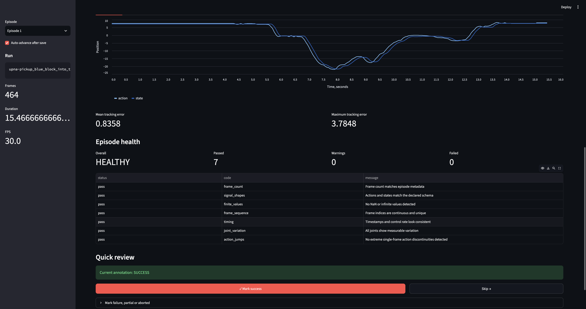

# RobotBench

Reliability and diagnostics for real-world robot learning.

RobotBench helps inspect robot-learning datasets and rollouts, detect data-quality problems, review actions and states alongside video, annotate task outcomes, and compare experiment health.

The project currently focuses on:

- [LeRobot](https://github.com/huggingface/lerobot) datasets;
- SO-101 manipulation experiments;
- local-first analysis;
- reproducible JSON reports;
- episode-level diagnostics and review.

> RobotBench is an early prototype. Calibration, camera timing, motor telemetry and automatic failure attribution are planned but not yet implemented.



## Why RobotBench?

When a real-world robot rollout fails, the cause is often unclear:

- Was the policy wrong?
- Was the dataset corrupted?
- Did calibration change?
- Were cameras or control signals out of sync?
- Did the gripper or another joint behave incorrectly?
- Did the task fail even though the recorded data looks healthy?

RobotBench is being developed to make these failures easier to inspect, reproduce and compare.

## Current features

### LeRobot import

RobotBench imports LeRobot episodes into an internal run manifest containing:

- source repository and revision;
- robot and task metadata;
- episode timing;
- action and state schemas;
- camera streams.

### Episode health diagnostics

The current analyzer checks:

- frame count;
- action and state shapes;
- NaN and infinite values;
- missing, duplicated or reordered frame indices;
- timestamp continuity and control-rate drift;
- frozen joints;
- extreme single-frame action discontinuities.

### Outcome annotations

Episodes can be manually marked as:

- `success`;
- `failure`;
- `partial`;
- `aborted`.

Supported failure modes include:

- `grasp_failed`;
- `object_dropped`;
- `missed_target`;
- `collision`;
- `timeout`;
- `hardware_fault`;
- `safety_stop`;
- `unknown`.

### Run summaries and comparison

RobotBench can aggregate episode reports and compare a candidate run collection against a baseline.

Comparison results include:

- health-rate delta;
- new issues;
- resolved issues;
- improved checks;
- regressed checks;
- overall verdict: `improved`, `regressed`, `mixed` or `unchanged`.

### Episode Review UI

The local Streamlit interface provides:

- episode selection;
- front and wrist camera video;
- action and state plots for every joint;
- mean and maximum tracking error;
- health-check results;
- outcome annotation editing.

The review workflow supports:

- one-click success annotation;
- compact failure annotation;
- optional failure timestamp;
- automatic saving;
- automatic navigation to the next episode;
- editing existing annotations.

The current version streamlines human review but does not yet
automatically infer task success from video.

## Quick start

### Requirements

- Python 3.13;
- [uv](https://docs.astral.sh/uv/);
- a local LeRobot-compatible dataset.

Install dependencies:

```bash
uv sync
```

Run the test suite:

```bash
PYTHONPATH=src uv run pytest -q
```

## Import episodes

The current example uses:

```text
upna/pickup_blue_block_into_the_yellow_tray
```

Import five episodes:

```bash
PYTHONPATH=src uv run python \
  -m robotbench.importers.lerobot_loader \
  --episodes 0,1,2,3,4
```

Generated run manifests are stored in:

```text
artifacts/runs/
```

## Analyze episode health

```bash
PYTHONPATH=src uv run python \
  -m robotbench.analysis.episode_health \
  --episodes 0,1,2,3,4 \
  --output artifacts/health
```

Generate an aggregated health summary:

```bash
PYTHONPATH=src uv run python \
  -m robotbench.analysis.summarize_health \
  --input artifacts/health \
  --output artifacts/health_summary.json \
  --name blue-block-baseline
```

## Annotate outcomes

Successful episode:

```bash
PYTHONPATH=src uv run python \
  -m robotbench.annotations.annotate_episode \
  --manifest artifacts/runs/episode_000000.json \
  --outcome success
```

Failed episode:

```bash
PYTHONPATH=src uv run python \
  -m robotbench.annotations.annotate_episode \
  --manifest artifacts/runs/episode_000001.json \
  --outcome failure \
  --failure-mode object_dropped \
  --phase transport \
  --timestamp 6.4 \
  --confidence 0.9
```

Generate the outcome summary:

```bash
PYTHONPATH=src uv run python \
  -m robotbench.analysis.summarize_outcomes \
  --runs artifacts/runs \
  --annotations artifacts/annotations \
  --output artifacts/outcome_summary.json \
  --name blue-block-demonstrations
```

## Compare run summaries

```bash
PYTHONPATH=src uv run python \
  -m robotbench.analysis.compare_runs \
  --baseline artifacts/baseline_summary.json \
  --candidate artifacts/candidate_summary.json \
  --output artifacts/comparison.json
```

## Run Episode Review

Video chunks should be available under:

```text
artifacts/source_videos/
```

Start the interface:

```bash
PYTHONPATH=src uv run streamlit run \
  src/robotbench/ui/app.py
```

Open:

```text
http://localhost:8501
```

## Generated artifacts

```text
artifacts/
├── annotations/
│   └── episode_000000.annotation.json
├── health/
│   └── episode_000000.health.json
├── runs/
│   └── episode_000000.json
├── source_videos/
├── comparison.json
├── health_summary.json
└── outcome_summary.json
```

Run manifests, health reports and summaries are JSON files designed to remain inspectable and usable by other tools.

## Project status

The current prototype supports dataset inspection and manual episode review.

Implemented:

- [x] LeRobot episode import;
- [x] internal run schema;
- [x] episode health checks;
- [x] automated tests for corrupted data;
- [x] health summaries;
- [x] baseline/candidate comparison;
- [x] outcome annotations;
- [x] outcome summaries;
- [x] local Episode Review UI.

Planned:

- [ ] generic configuration for arbitrary LeRobot repositories;
- [ ] exact episode boundaries from LeRobot video metadata;
- [ ] multi-chunk video support;
- [ ] calibration snapshots and drift detection;
- [ ] camera FPS and synchronization diagnostics;
- [ ] SO-101 motor current, load, voltage and temperature;
- [ ] preflight checks;
- [ ] automatic failure attribution;
- [ ] standardized 3D-printable SO-101 task fixtures.

## Current limitations

- The example configuration is currently tied to one test dataset.
- Episode video intervals are calculated from cumulative episode durations.
- The UI currently selects the first matching video chunk for each camera.
- Hardware and calibration diagnostics require a physical robot.
- Outcome annotations are manual.
- A healthy demonstration dataset does not imply that a trained policy will succeed.

## Product direction

The long-term goal is:

> Find out whether a failed real-world robot experiment came from the policy, data, calibration, sensors or hardware.

RobotBench is intended to become a local-first reliability and observability toolkit for real-world robot learning, starting with SO-101 and LeRobot.

## Safety

RobotBench is currently a research and development tool. It must not be used as the sole safety mechanism for physical robot operation.
